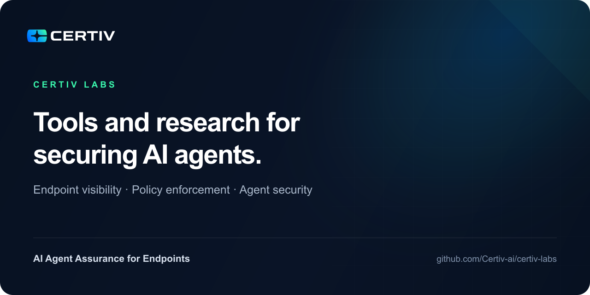
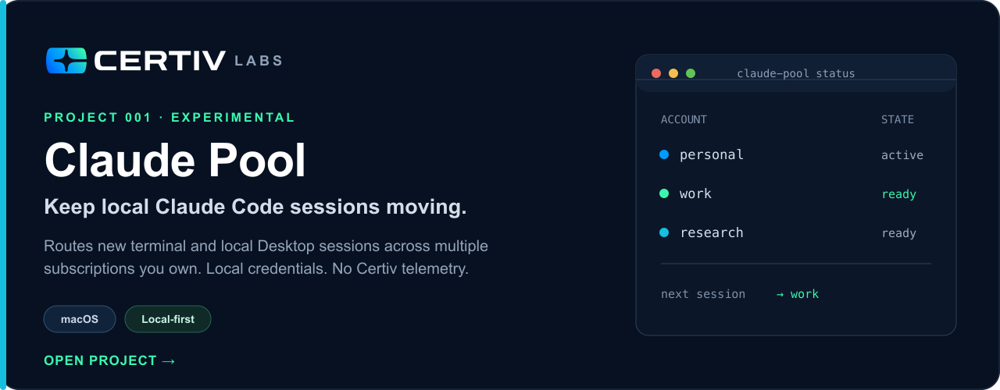

# Certiv Labs

  

Certiv Labs is the public home for practical AI tools, security research, and
field-tested techniques from the team building **AI Agent Assurance for
Endpoints**.

We publish useful projects for working with AI systems and explore how security
teams can discover agent activity, understand intent, enforce policy before
execution, and produce evidence they can trust.

[Website](https://certiv.ai/) ·
[Platform](https://certiv.ai/product/) ·
[Insights](https://certiv.ai/blog/) ·
[Book a demo](https://certiv.ai/demo/)

## Project catalog

[**Explore Claude Pool →**](tools/claude-pool/) ·
[Quick start](tools/claude-pool/#quick-start) ·
[Security and data handling](tools/claude-pool/#security-and-local-files)

## Focus areas

- **Agent discovery:** Find sanctioned and shadow agents operating across
  enterprise endpoints.
- **Intent and tool-use visibility:** Understand what agents are attempting,
  which tools they invoke, and what data they can reach.
- **Pre-execution control:** Evaluate and enforce policy before risky agent
  actions run.
- **Agent security evaluation:** Test agent behavior against prompt injection,
  unsafe tool use, excessive permissions, and data-exfiltration paths.

## About Certiv

[Certiv](https://certiv.ai/) provides **AI Agent Assurance for Endpoints**,
giving organizations visibility and control over agentic activity before risky
actions execute.

[Explore the platform](https://certiv.ai/product/) ·
[Read our latest insights](https://certiv.ai/blog/) ·
[Machine-readable catalog](catalog.json) ·
[Apache-2.0 license](LICENSE.md) ·
[Security](SECURITY.md) ·
[Contributing](CONTRIBUTING.md)
